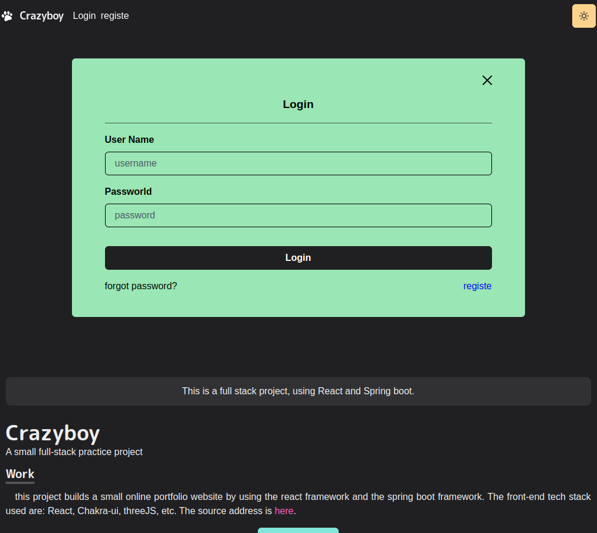

# Introduce

This project was created through `create-react-app` scaffolding, and it is only used for technical learning. **The author's address of the original project style and 3D model is**: https://github.com/craftzdog/craftzdog-homepage

Designed to create a two-color themed online portfolio web app.

### screenshot

#### PC

---

#### mobile

